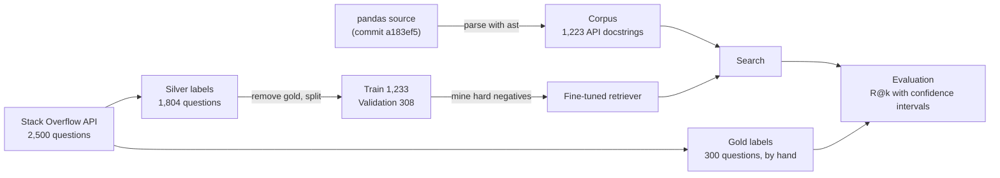

# docsearch

Search over the pandas API documentation that finds the right function for a question
written in everyday words, trained and evaluated on real Stack Overflow questions.

People rarely ask "how do I use `dropna`". They ask "how do I delete rows with empty
cells", and keyword search fails when the question and the documentation use different
words. This project measures that problem honestly and closes part of it by fine-tuning a
small embedding model on Stack Overflow question/answer pairs.

## Results

Gold test set: 300 hand-labelled Stack Overflow questions, 256 answerable from the corpus.
The table shows the 189 questions whose answer's name does **not** appear in the question
title, where keyword matching cannot help. R@5 is the share of questions with a correct
function in the top 5 results.

| Method | R@5, any correct function | R@5, the single best function |
|---|---|---|
| BM25 keyword search | 0.38 | 0.28 |
| `all-MiniLM-L6-v2` embeddings | 0.42 | 0.32 |
| Fine-tuned on Stack Overflow pairs | 0.50 | 0.35 |
| **Fine-tuned with mined hard negatives** | **0.63** | **0.47** |

Final model vs BM25: +0.25 (95% CI [+0.17, +0.33]) and +0.19 (95% CI [+0.11, +0.26]).
Paired bootstrap over questions; R@5 was fixed as the comparison metric in advance.

Numbers are produced by `scripts/evaluate_retrieval.py`. Every experiment, including those
that did not work (such as cross-encoder reranking), is recorded in
[docs/EXPERIMENTS.md](docs/EXPERIMENTS.md).

## How it works



1. **Corpus.** Public docstrings of at least 20 words, extracted from pandas source with
   `ast` (pandas is never imported). Only names reachable from `import pandas` are kept.
2. **Silver labels.** The pandas functions used in each question's accepted answer. Cheap
   but loose: a manual review of 50 found 34% correct, 50% loose, 16% wrong. Used only to
   train and to choose settings.
3. **Gold labels.** 300 questions labelled by hand with the best function and other correct
   ones. Used only for the final score. See [annotations/README.md](annotations/README.md).
4. **Leakage protection.** Gold questions are removed from training data by id and by
   normalised title; the split raises an error if any gold question gets through.
5. **Training.** MultipleNegativesRankingLoss with one mined hard negative per pair: a
   document the base model ranks highly that is not a correct answer.

## Setup

Developed on Windows 11 with Python 3.12.10 and an NVIDIA RTX 3050 (4 GB); the results
above come from that machine. Installation from scratch on other systems has not been
tested. Training also runs on CPU, more slowly.

```bash
python -m venv .venv
.venv/Scripts/python -m pip install -r requirements-dev.txt
.venv/Scripts/python -m pip install -e . --no-deps
.venv/Scripts/python -m pytest -q
```

On Linux or macOS use `.venv/bin/python`. `requirements.txt` installs CUDA 12.8 builds of
PyTorch; removing its `--extra-index-url` line installs the CPU build.

## Reproducing the pipeline

Get the exact pandas source the corpus was built from:

```bash
git init data/raw/pandas
git -C data/raw/pandas fetch --depth 1 https://github.com/pandas-dev/pandas.git a183ef5779ecce1a5f3d6b766e130cf860afdfaf
git -C data/raw/pandas checkout FETCH_HEAD
```

Then run the steps in order:

```bash
.venv/Scripts/python scripts/build_corpus.py
.venv/Scripts/python scripts/fetch_stackoverflow.py
.venv/Scripts/python scripts/build_eval_set.py
.venv/Scripts/python scripts/split_eval_data.py
.venv/Scripts/python scripts/train_retriever.py --seed 3
.venv/Scripts/python scripts/train_retriever.py --hard-negatives --seed 3 --output-dir models/retriever-minilm-ft-hn
.venv/Scripts/python scripts/evaluate_retrieval.py
```

`fetch_stackoverflow.py` uses the anonymous Stack Exchange API (about 50 requests, within
the 300-per-day limit) and caches every response. The results above use questions fetched
on 2026-09-13. Those responses are not redistributed, and vote order changes over time, so
a fresh fetch gives a different silver set; the gold question ids stay fixed.

## Repository layout

```
src/docsearch/     pipeline logic, one module per step
scripts/           command-line entry points for each step
tests/             unit tests
annotations/       hand-made gold labels (tracked; everything under data/ is generated)
docs/              experiment log
```

## Limitations

- Gold labels were made by a single annotator.
- The corpus is API docstrings only; the pandas user guide is not included, and 5 gold
  questions are unanswerable because of known corpus gaps (for example `dt.year`).
- Silver labels are loose, which limits what training can learn; a cross-encoder reranker
  trained on them did not beat the retriever.
- The model is small (22M parameters) and was trained on 1,233 questions.
- There is no answer generation yet: the system returns documentation, not written answers.

## Data and licences

- pandas documentation text is from the pandas source code, BSD 3-Clause License.
- Stack Overflow question titles in `annotations/` are licensed under
  [CC BY-SA 4.0](https://creativecommons.org/licenses/by-sa/4.0/); each row links to its question.
